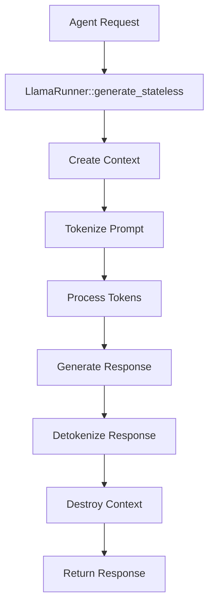
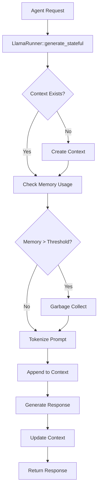

# llama_runner Architecture

## System Overview

llama_runner is a Rust FFI wrapper around llama.cpp designed for agent integration with explicit memory management and dual execution modes.

## Design Principles

1. **Separation of Concerns**: Clear boundaries between FFI, API, and user interfaces
2. **Memory Control**: Explicit context management for agent systems
3. **Performance First**: Static linking and direct FFI calls for maximum speed
4. **Agent Integration**: API designed for AI agent consumption, not human interaction
5. **Dual Execution**: Both stateless (fast) and stateful (conversational) modes

## Layer Architecture

```
┌─────────────────────────────────────────────────────────────────┐
│                        User Layer                               │
├─────────────────┬─────────────────┬─────────────────────────────┤
│   CLI Interface │  Agent Systems  │    HTTP/IPC Services        │
│   (main.rs)     │  (MARK Agents)  │    (Future Extensions)      │
└─────────────────┴─────────────────┴─────────────────────────────┘
                                │
┌─────────────────────────────────────────────────────────────────┐
│                      API Layer                                  │
├─────────────────────────────────────────────────────────────────┤
│  Core API (api/mod.rs)                                          │
│  ├─ LlamaRunner                                                 │
│  ├─ Stateless Generation                                        │
│  ├─ Stateful Generation                                         │
│  ├─ Context Management                                          │
│  └─ Quick API                                                   │
│                                                                 │
│  Agent Integration (prompts/mod.rs)                             │
│  ├─ MARK System Templates                                       │
│  ├─ Chat Format Detection                                       │
│  └─ Pronunciation Optimization                                  │
└─────────────────────────────────────────────────────────────────┘
                                │
┌─────────────────────────────────────────────────────────────────┐
│                    Orchestration Layer                         │
├─────────────────────────────────────────────────────────────────┤
│  Token Management (tokens/mod.rs)                              │
│  ├─ Tokenization                                               │
│  ├─ Batch Building                                             │
│  ├─ Detokenization                                             │
│  └─ Sampler Creation                                           │
│                                                                 │
│  Model Management (loaders/mod.rs)                             │
│  ├─ Metadata Loading                                           │
│  ├─ Validation                                                 │
│  └─ Configuration                                              │
│                                                                 │
│  Error Handling (errors/mod.rs)                               │
│  └─ Unified Error Types                                        │
└─────────────────────────────────────────────────────────────────┘
                                │
┌─────────────────────────────────────────────────────────────────┐
│                       FFI Layer                                 │
├─────────────────────────────────────────────────────────────────┤
│  Generated Bindings (bindings/mod.rs)                          │
│  ├─ llama_cpp.rs (Generated by bindgen)                        │
│  ├─ Function Bindings                                          │
│  ├─ Type Definitions                                           │
│  └─ Constant Definitions                                       │
└─────────────────────────────────────────────────────────────────┘
                                │
┌─────────────────────────────────────────────────────────────────┐
│                    Native Layer                                 │
├─────────────────────────────────────────────────────────────────┤
│  llama.cpp (C++ Implementation)                                │
│  ├─ Model Loading                                              │
│  ├─ Tokenization                                               │
│  ├─ Inference Engine                                           │
│  ├─ Memory Management                                          │
│  └─ GPU Acceleration                                           │
│                                                                 │
│  ggml (Mathematical Operations)                                 │
│  ├─ Tensor Operations                                          │
│  ├─ CPU Optimizations (AVX, NEON)                             │
│  └─ GPU Kernels (CUDA, Metal)                                 │
└─────────────────────────────────────────────────────────────────┘
```

## Module Architecture

### api/mod.rs - Core API Layer

**Responsibility**: Primary interface for agents and applications

**Key Components**:
- `LlamaRunner`: Main struct managing model lifecycle
- `GenerationParams`: Configuration for inference
- `ContextInfo`: Memory usage reporting
- Stateless vs Stateful execution modes

**Design Patterns**:
- Builder pattern for configuration
- RAII for resource management
- Result types for error handling

### tokens/mod.rs - Token Management

**Responsibility**: Token processing and batch operations

**Key Components**:
- `tokenize()`: Text to token conversion
- `detokenize()`: Token to text conversion  
- `build_batch()`: Batch preparation for llama.cpp
- `create_sampler()`: Sampling strategy configuration

**Performance Considerations**:
- Zero-copy operations where possible
- Batch processing for efficiency
- Memory-aligned data structures

### loaders/model.rs - Model Management

**Responsibility**: Model metadata and validation

**Key Components**:
- `ModelMetadata`: Model configuration structure
- `load_model()`: JSON metadata parsing
- `validate_model()`: Model file validation

**Configuration Format**:
```json
{
  "name": "Model Display Name",
  "path": "path/to/model.gguf",
  "architecture": "llama|qwen|mistral",
  "quantization": "Q4_K_M|Q5_K_M|Q8_0",
  "context_length": 4096
}
```

### prompts/mod.rs - Prompt Engineering

**Responsibility**: Chat format handling and agent templates

**Key Components**:
- Chat format detection and formatting
- MARK system agent templates
- Pronunciation optimization
- Context-aware prompt building

### bindings/mod.rs - FFI Abstraction

**Responsibility**: Safe Rust interface to llama.cpp

**Generation Process**:
1. `wrapper.h` defines C interface
2. `bindgen` generates Rust FFI code
3. `build.rs` compiles and links llama.cpp
4. Static linking creates single binary

## Execution Flow

### Stateless Generation



### Stateful Generation



## Memory Management Strategy

### Context Window Management

The system implements a three-tier memory management strategy:

1. **Proactive Monitoring**: `get_context_info()` reports usage
2. **Garbage Collection**: `gc_context()` removes old tokens
3. **Full Reset**: `clear_context()` empties context entirely

### Memory Lifecycle

```
┌─────────────┐    ┌─────────────┐    ┌─────────────┐
│   Empty     │───▶│   Growing   │───▶│    Full     │
│  Context    │    │   Context   │    │  Context    │
└─────────────┘    └─────────────┘    └─────────────┘
       ▲                   │                   │
       │                   ▼                   ▼
┌─────────────┐    ┌─────────────┐    ┌─────────────┐
│   Reset     │◀───│ Cleaned Up  │◀───│ GC Trigger  │
│             │    │  (Partial)  │    │ (80%+ full) │
└─────────────┘    └─────────────┘    └─────────────┘
```

## Build Architecture

### Compilation Pipeline

1. **Pre-build**: Check dependencies (CMake, C++ compiler)
2. **Configure**: Generate CMake build with feature detection
3. **Compile**: Build llama.cpp with optimizations
4. **Generate**: Create Rust FFI bindings with bindgen
5. **Link**: Static link libraries into Rust binary

### Feature Detection

The build system automatically detects and enables:

- **CPU Features**: AVX2, FMA, AVX512 (x86_64), NEON (ARM64)
- **GPU Support**: CUDA, Metal, OpenCL, Vulkan
- **Threading**: OpenMP, pthreads
- **Math Libraries**: OpenBLAS, Accelerate (macOS)

### Cross-Platform Support

```
┌─────────────┐    ┌─────────────┐    ┌─────────────┐
│   Windows   │    │    Linux    │    │    macOS    │
├─────────────┤    ├─────────────┤    ├─────────────┤
│ MSVC/MinGW  │    │     GCC     │    │    Clang    │
│   CUDA      │    │ CUDA/ROCm   │    │    Metal    │
│  DirectML   │    │   Vulkan    │    │  Accelerate │
└─────────────┘    └─────────────┘    └─────────────┘
```

## Performance Architecture

### Thread Model

```
Main Thread
├─ Model Loading (Blocking)
├─ Context Management
└─ API Coordination
    │
    ├─ Inference Threads (N cores)
    │  ├─ Matrix Operations
    │  ├─ Attention Computation
    │  └─ Layer Processing
    │
    └─ Batch Threads (N/4 cores)
       ├─ Token Processing
       ├─ Sampling
       └─ Output Generation
```

### Memory Layout

- **Model Weights**: Memory-mapped, read-only
- **KV Cache**: Dynamically allocated, managed by context
- **Token Buffers**: Stack-allocated for small batches
- **Intermediate Tensors**: GPU memory when available

## Agent Integration Patterns

### Pattern 1: Stateless Worker

```rust
// Fire-and-forget pattern
struct Worker {
    model_path: PathBuf,
}

impl Worker {
    fn process(&self, task: &str) -> Result<String> {
        quick::generate_once(&self.model_path, task, 200)
    }
}
```

**Use Cases**: Independent queries, batch processing, parallel workers

**Characteristics**:
- No memory overhead between requests
- Maximum throughput for independent tasks
- CPU/GPU resources freed immediately

### Pattern 2: Conversational Agent

```rust
// Persistent context pattern
struct Agent {
    runner: LlamaRunner,
    memory_limit: f32,
}

impl Agent {
    fn chat(&mut self, message: &str) -> Result<String> {
        self.manage_memory()?;
        self.runner.generate_stateful(message, 200)
    }
}
```

**Use Cases**: Multi-turn conversations, context-dependent tasks

**Characteristics**:
- Context preserved between interactions
- Memory growth requires management
- Higher resource usage but better coherence

### Pattern 3: Managed Pool

```rust
// Resource pool pattern
struct AgentPool {
    runners: Vec<LlamaRunner>,
    available: VecDeque<usize>,
}

impl AgentPool {
    fn get_runner(&mut self) -> Option<&mut LlamaRunner> {
        self.available.pop_front()
            .map(|idx| &mut self.runners[idx])
    }
}
```

**Use Cases**: High concurrency, resource optimization

**Characteristics**:
- Amortized initialization cost
- Controlled memory usage
- Load balancing across instances

## Error Handling Architecture

### Error Propagation

```
Agent Request
      │
┌─────▼─────┐
│ API Layer │──┐
└───────────┘  │
┌─────▼─────┐  │ Result<T, LlamaError>
│FFI Layer  │  │
└───────────┘  │
┌─────▼─────┐  │
│C++ Layer  │  │
└───────────┘  │
      │        │
   ┌──▼──┐     │
   │Error│─────┘
   └─────┘
```

### Error Categories

1. **System Errors**: Missing dependencies, permission issues
2. **Model Errors**: Invalid GGUF files, unsupported architectures
3. **Runtime Errors**: Memory exhaustion, tokenization failures
4. **Logic Errors**: Invalid parameters, state violations

## Security Considerations

### Memory Safety

- All FFI operations use safe Rust wrappers
- Raw pointers confined to specific modules
- Automatic cleanup via RAII patterns
- Buffer overflow protection in token processing

### Resource Management

- Context size limits prevent memory exhaustion
- Thread count validation prevents CPU oversubscription
- Model validation prevents malicious file loading
- Graceful degradation under resource pressure

This architecture supports your MARK system's requirement for both high-performance inference and explicit memory control while maintaining safety and reliability.